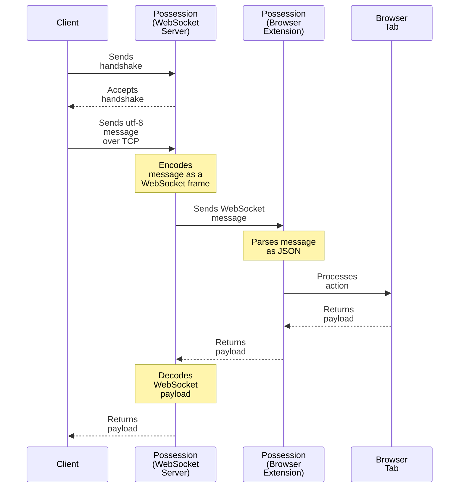
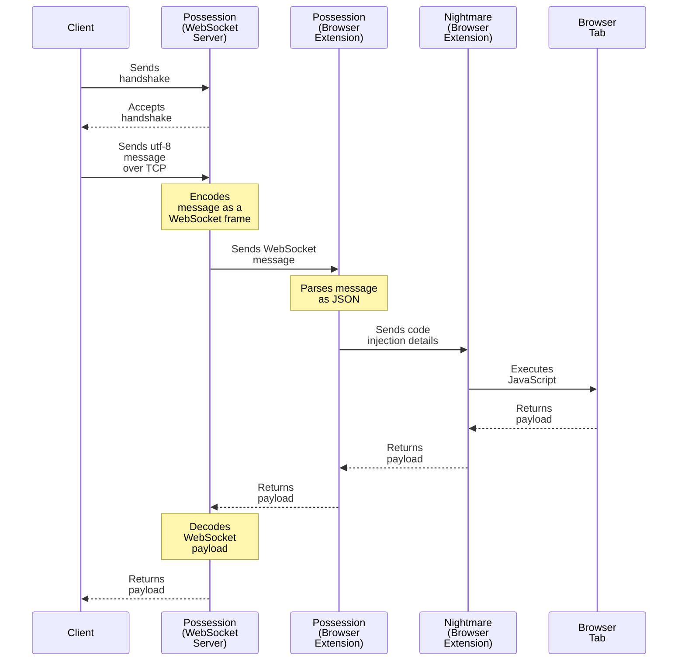

# possession

## Non-Code Execution Message

```python
s = socket.socket(socket.AF_INET, socket.SOCK_STREAM)
s.connect(("127.0.0.1", 8080))
s.send(b"client") # handshake
buf = s.recv(1)
if buf != b"\x01":
    print("client rejected")
    return
s.send(b'{"type":"text","query":"h1"}')
buf = s.recv(1024) # payload
print(buf.decode()) # {"ok": true, "payload": "Inner text of h1 tag"}
s.close()
```



## Code Execution Message

```python
s = socket.socket(socket.AF_INET, socket.SOCK_STREAM)
s.connect(("127.0.0.1", 8080))
s.send(b"client") # handshake
buf = s.recv(1)
if buf != b"\x01":
    print("client rejected")
    return
s.send(
    json.dumps(
        {
            "type": "execute",
            "details": {"code": "alert('hello possesssion');"},
        }
    ).encode()
)
buf = s.recv(1024) # payload
print(buf.decode()) # {"ok": true, "payload": ""}
```



## Large Message

If your message is larger than 1014 bytes, you need to send the message size
first. The first byte specifies how many additional bytes are used to represent
the message size, and must contain a value from 1 to 8. The following 1 to 8
bytes contain the message size as a big-endian integer.

When your message is less than 1014 bytes you don't need to send the size of
your message. The possession server will handle this for you.

| Bytes | Size | Bits                                                    |
| ----- | ---- | ------------------------------------------------------- |
| 1     | u8   | [1,1,0,0,1,0,0,0]                                       |
| 2     | u16  | [1...],[1...]                                           |
| ...   | ...  | ...                                                     |
| 8     | u64  | [1...],[1...],[1...],[1...],[1...],[1...],[1...],[1...] |

```python
s = socket.socket(socket.AF_INET, socket.SOCK_STREAM)
s.connect(("127.0.0.1", 8080))
s.send(b"client") # handshake
buf = s.recv(1)
if buf != b"\x01":
    print("client rejected")
    return
msg = json.dumps(
        {
            "type": "execute",
            "details": {
              "code": "alert('" + "A" * 100_000_000 + "');" # 100 MB string
            },
        }
    ).encode()
size = len(msg)
bytes_sent = math.ceil(size.bit_length() / 8)
bits = size.to_bytes(bytes_sent, "big")
s.send(bytes([bytes_sent]) + bits + msg)
buf = s.recv(1024)
print(buf.decode()) # {"ok": true, "payload": ""}
s.close()
```
